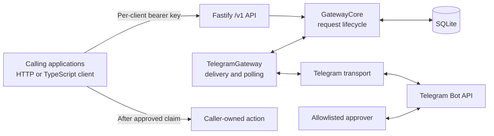

# Architecture and schema overview

JaGate is one Node.js process with a versioned HTTP API, a core request lifecycle, a SQLite database, and a Telegram adapter. A caller proposes an action and later performs it itself. The gateway stores intent, records a human decision, and coordinates a single claim; it never executes the action.



## Responsibilities

| Component | Responsibility |
| --- | --- |
| `src/config.ts` and `src/main.ts` | Validate environment configuration, open SQLite, start Telegram and HTTP, and shut them down. Only one process should use a bot token and database. |
| `src/http.ts` | Resolves each `/v1` bearer key to a client ID, validates bodies and IDs, maps lifecycle errors to documented HTTP responses, and exposes `/health` and `/ready`. |
| `src/core.ts` | Owns state transitions, idempotency, expiry, delivery records, atomic claim, and result reporting. It has no HTTP or Telegram request types. Its clock is injected for deterministic tests. |
| `src/storage.ts` and `migrations/` | Opens SQLite in WAL mode and applies numbered SQL migrations transactionally. |
| `src/telegram.ts` | Formats and escapes messages, sends with buttons, checks numeric chat and user IDs, polls callbacks, and asks the core to decide. The transport interface lets tests use an in-memory fake. |
| `src/client.ts` | Makes authenticated HTTP calls and polls for a decision. Its wait timeout and `AbortSignal` affect only the client wait, not the stored request. |

The HTTP API is usable from any language. The TypeScript client is a convenience wrapper over that same API, not a separate approval path.

## How a request moves through the system

1. The caller sends `POST /v1/requests` with its own bearer key, an idempotency key, and the exact action description. The HTTP layer resolves the immutable client ID from the key. Validation bounds text, metadata, details, and expiry. The core stores the canonical content and its fingerprint before attempting Telegram delivery. A repeat under the same client ID with the same key and content returns the existing row; changed content returns a conflict. Another client can reuse that idempotency key independently.
2. The Telegram worker reads due rows from SQLite, sends a message to the configured chat, and records the returned message ID. The message shows the client ID, action, title, description, details, short request ID, and expiry. Metadata stays with the owning client's API response and is not sent to Telegram. Transient send errors update the row to `retrying` with bounded backoff; a terminal error is visible as `failed`.
3. Long polling receives button callbacks. The adapter checks the numeric approver user ID and expected chat ID. The core checks the opaque callback reference against the stored message ID and conditionally updates a still-pending, unexpired request. Repeated, late, or wrong-message callbacks cannot reverse a decision. The adapter answers the callback and tries to edit the message to remove its buttons.
4. Only the owning client can read `GET /v1/requests/:id` or use `waitForDecision`. On approval, it calls `POST /v1/requests/:id/claim`. One owner-scoped conditional SQLite update moves execution from `unclaimed` to `claimed`; other claim attempts get a conflict. The response contains a one-time claim token. Only its hash is stored.
5. The caller performs the action with its own credentials and reports `succeeded` or `failed` using the claim token. The gateway records that outcome but cannot verify or undo the external action.

## SQLite schema at a glance

The initial schema, including client ownership, is in [`migrations/001_initial.sql`](https://github.com/ahmetomerv/JaGate/blob/main/migrations/001_initial.sql). There are three tables and no user-account or workflow tables.

| Table | Main fields | Purpose |
| --- | --- | --- |
| `requests` | `id`, `client_id`, `idempotency_key`, `fingerprint`, `content_json`, action/title/description/details/metadata, timestamps | One immutable proposal owned by a client. `(client_id, idempotency_key)` is unique; the canonical content and fingerprint enforce idempotency across restarts. |
| `requests` | `decision_status`, `decided_by`, `decided_at`, `expires_at` | Human decision or pending expiry/cancellation. `decided_by` is the numeric Telegram user ID for button decisions. |
| `requests` | `delivery_status`, `delivery_attempts`, `next_delivery_at`, `delivery_error`, `callback_ref`, `delivery_message_id` | A small durable notification queue and the binding between one Telegram button and its stored message. The callback contains only the opaque reference and desired decision. |
| `requests` | `execution_status`, `claimed_at`, `claim_id`, `claim_token_hash`, `result_summary`, `result_at` | Claim ownership and the caller-reported outcome. The raw claim token is never stored. |
| `settings` | `key`, `value` | Stores the Telegram polling offset. An update ID is saved only after that update has been handled. |
| `schema_migrations` | `version` | Records which numbered SQL migrations were applied. |

The `requests` row is the authoritative record. There is no separate execution queue: the gateway does not run actions. The indexes support due-delivery and pending-expiry scans.

Client IDs and keys live in `CLIENT_KEYS` in the server environment, not in the database. The database stores only the client ID on each request. Changing a key for the same ID preserves access.

## State transitions

Decision and execution are separate fields:

```text
Decision:  pending ──► approved | rejected | expired | cancelled
Execution: unclaimed ──► claimed ──► succeeded | failed
```

Only `approved + unclaimed` can be claimed. Expiry applies while a request is pending; a decision made before the deadline stays approved even if the caller claims later. A claimed request with no result has an **unknown external outcome**. It never becomes claimable again automatically, because the caller might have performed the action before crashing.

## Trust and failure boundaries

- Each client key authorizes creation under its own client ID and access only to its own requests. Reads, cancellation, claims, and results for another client's request return 404. `/health` and `/ready` are public and return no credentials. The configured Telegram chat and allowlisted numeric user IDs control button decisions for every client; usernames and forwarded messages do not grant authority. All clients share the same chat and approvers.
- The immutable stored proposal tells the approver what was approved. The caller must use those same parameters when executing. Action credentials stay in the caller's application, and no HTTP field is interpreted as a command, URL to call, script, or callback to execute.
- SQLite writes settle decisions and claims before external follow-up work. Telegram message edits are best effort; a failed edit does not undo a decision. Polling offsets advance after processing, so replay after a crash is safe because decision updates are conditional.
- A crash between Telegram accepting a send and SQLite storing its message ID can cause a duplicate message on retry. Only the message ID stored in SQLite can decide the request. Delivery status and sanitized errors remain visible through the API.
- `/ready` requires working storage and a ready Telegram poller/delivery worker; new creation is rejected while it is not ready. Existing requests can still be read. One instance is supported; multiple pollers or a pre-existing webhook for the bot token are rejected.
- The gateway cannot guarantee exactly once execution of an outside effect. A caller should use an idempotency key with the target system where possible, retain the claim token until reporting, and reconcile an unknown outcome against the target before creating a new request.

## Verification

`npm test` uses temporary SQLite databases, an injected clock, a fake Telegram transport, and an injected HTTP fetcher. It covers lifecycle and expiry boundaries, restart recovery, owner-scoped idempotency and authorization, initial schema creation, API validation, Telegram authorization and callback binding, delivery retries and failure, polling offset replay, claim races, and client waiting. `npm run test:coverage` prints a source coverage report. Tests never use a real bot token or contact Telegram.
